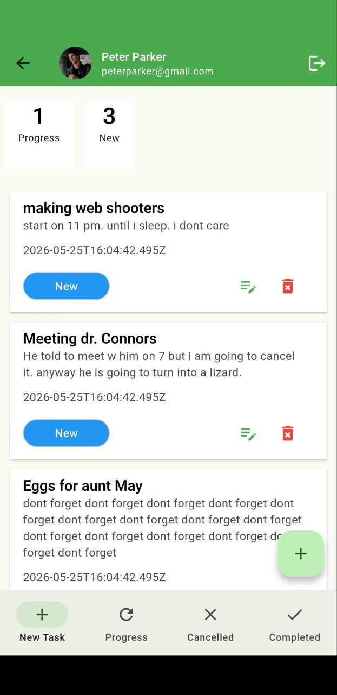
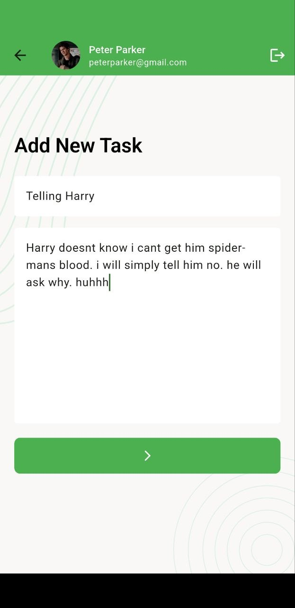
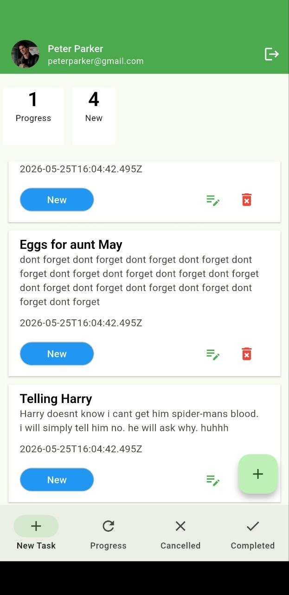
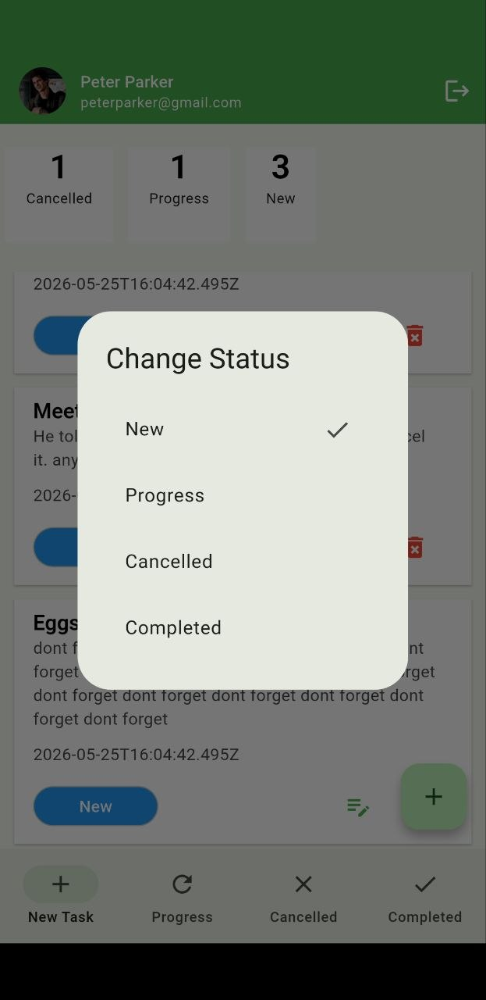
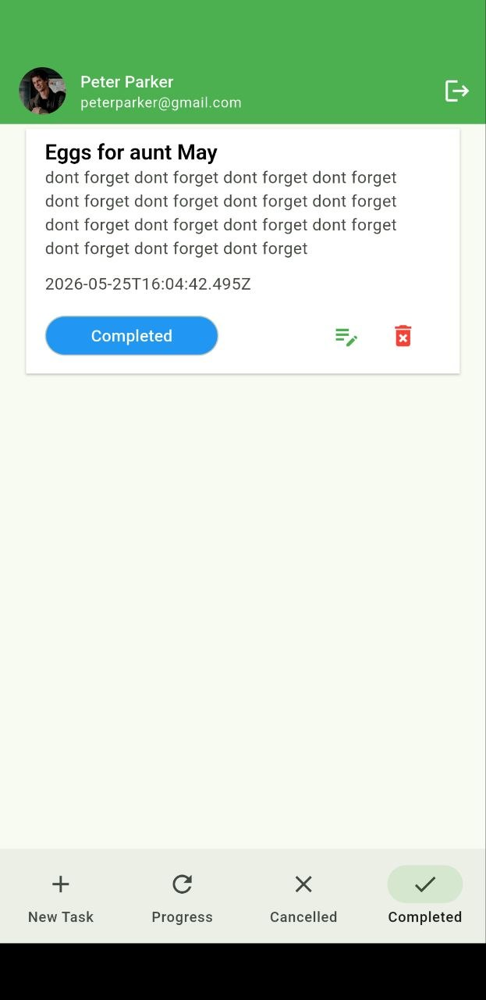
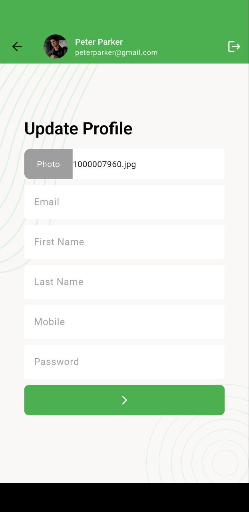
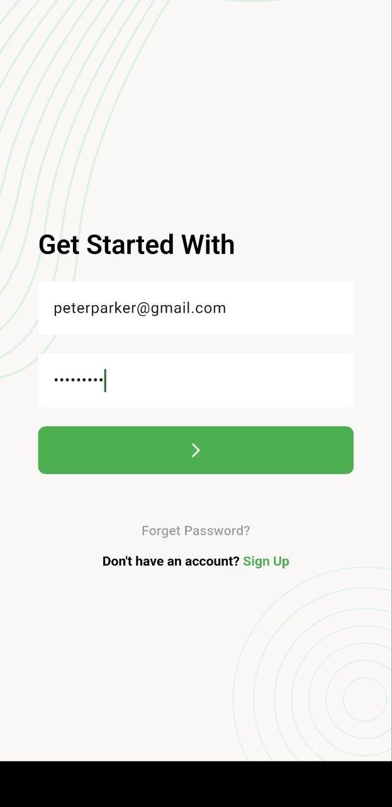
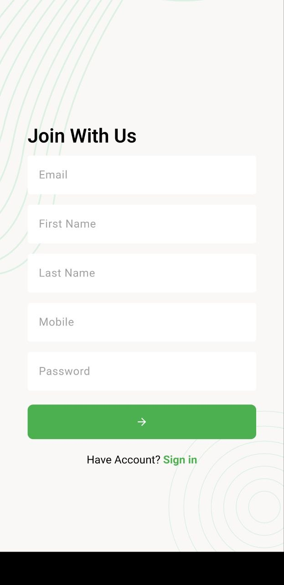
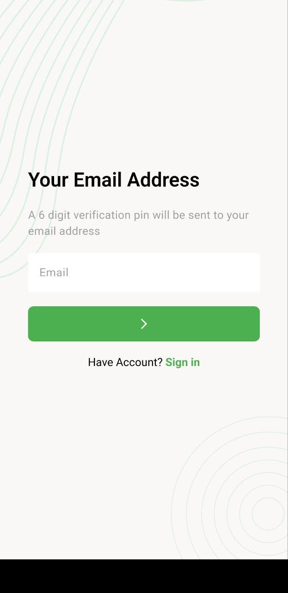
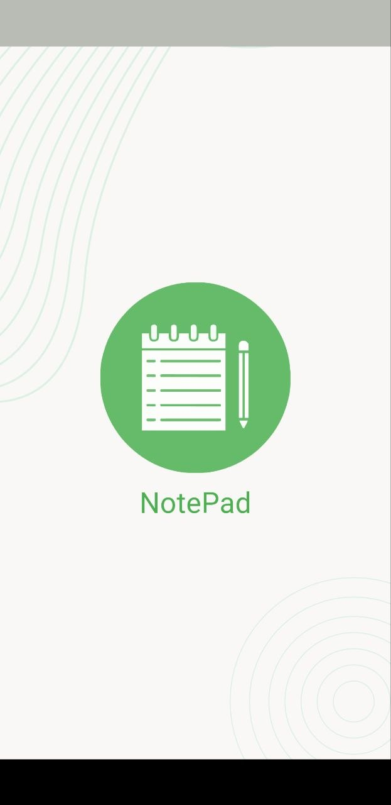

# Task Management App

A Flutter-based task management application that helps users organize, track, and manage daily tasks efficiently.

## Features

- User Authentication
- Create New Tasks
- Update Task Status
- Track Task Progress
- Password Recovery
- Profile Management
- REST API Integration
## App Screenshots

  
  
  

  
  
  

  
  
  

  

